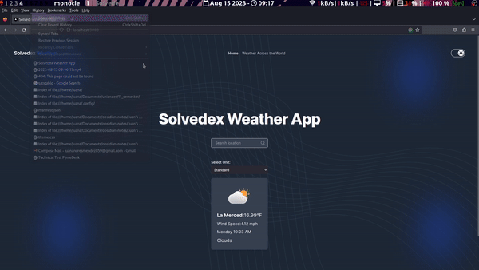

# Weather Across the World: A Next.js Application

Welcome to my technical test project! This web application is designed to showcase the weather from around the globe using the OpenWeatherMap API. I've leveraged the power of React, TypeScript, TailwindCSS, and Redux to bring this project to life. Let's dive into the details.

## 🚀 Features

1. **Dynamic Search Bar**: Instead of loading thousands of locations on the client side, our search bar fetches location data on-the-go as you type. This not only enhances SEO performance but also improves usability.
2. **Responsive Design**: Whether you're on mobile, tablet, desktop, or a wide monitor, this application adjusts beautifully, all thanks to the power of TailwindCSS.
3. **Dark Mode Integration**: Experience the application in both light and dark themes. It adapts to your system preferences and also lets you choose your preferred mode.
4. **Accurate Mockup Representation**: The design closely follows the Figma mockup provided, ensuring a seamless visual experience.
5. **Toggle Metrics**: Switch between different metrics effortlessly without a hitch.

## 🛠️ Technologies & Tools

- **Next.js 13 with App Router Paradigm**: This new approach in web development offers:
  - [List all the benefits of the new approach here]
- **TypeScript**: Enhancing JavaScript with static type definitions.
- **TailwindCSS**: A utility-first CSS framework that makes designing responsive layouts a breeze.
- **Redux**: For efficient, predictable state management.
- **ESLint with Airbnb Config**: Ensuring code quality and consistency.
- **Husky & Commitlint**: Leveraging git hooks to ensure high-quality commits.
- **Cypress**: For end-to-end and integration testing with a mock API.

## 📈 Workflow & Best Practices

I believe in not just writing code, but crafting experiences. To ensure the highest quality:

- **Linting**: A custom ESLint configuration, heavily inspired by Airbnb's linter, ensures that the code remains clean and consistent.
- **Commit Quality**: With Husky and Commitlint, every commit is ensured to be of high quality.
- **Testing**: Comprehensive tests using Cypress ensure that the application runs flawlessly, simulating real-world scenarios with a mock API.

## 🎯 Purpose

The essence of this project is to demonstrate my approach to building web applications, emphasizing best practices, performance, and user experience. As a React FrontEnd developer, I strive to stay updated with the latest in the field, ensuring that I bring value to any team I join. This project is a testament to my skills, experience, and dedication to crafting meaningful digital experiences.

🎥 Demo
Experience the application in action! Check out the demo gif below:

Weather App Demo

This gif provides a quick overview of the application's main features and user interface. It's a great way to get a feel for the application without having to set it up locally.

